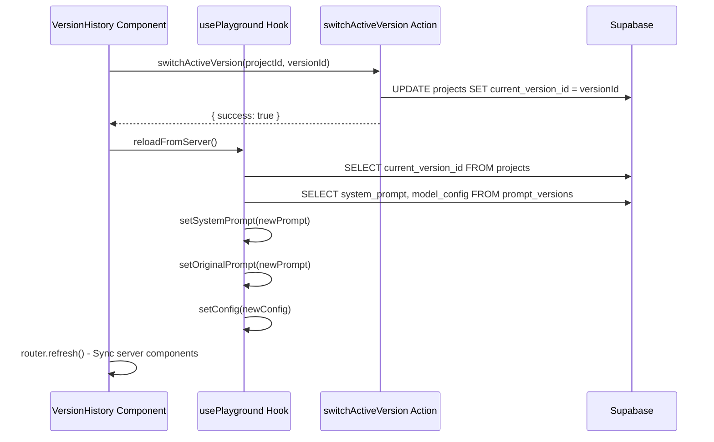

# Orvion Labs Architecture Documentation

## 🚀 Current Mission
We have successfully implemented a **Durable Background Runner** system using Inngest and Supabase, enabling reliable, asynchronous execution of large AI test suites with atomic credit management and real-time result streaming.

**Recent Achievement (2025-12-28):** Completed a comprehensive **Lego Blocks Architecture Refactoring** of the Playground system, decomposing a 565-line monolithic component into focused, testable modules.

---

## 🛠 System Architecture
The system employs a modern, event-driven architecture designed for scalability and stateful execution:

1.  **Orchestrator (Inngest)**: Manages the lifecycle of test runs. It ensures that long-running LLM calls are processed durably, providing automatic retries and state persistence for each individual test case.
2.  **Execution Engine (Next.js & OpenAI)**: Background workers (`executeTestSuite`) perform the actual LLM calls and grading logic. These are decoupled from the request-response cycle of the frontend.
3.  **Real-time Data Layer (Supabase)**:
    - **PostgreSQL**: Stores projects, test cases, runs, and results.
    - **Realtime (WAL)**: Streams `test_results` inserts directly to the frontend `useTestSuite` hook.
    - **Admin Layer**: A specialized `createAdminClient` allows workers to bypass RLS for critical system updates (e.g., credit deduction).

---

## 📊 Database Schema (Source of Truth)
The schema is optimized for tracking temporal performance and cost:

- **`profiles`**: Stores user-specific settings and `credits` (Integer).
- **`projects`**:
    - `id` (UUID, Primary Key)
    - `current_version_id` ⮕ `prompt_versions.id` (Foreign Key to active version)
    - `name`, `description`, `user_id`
- **`prompt_versions`**:
    - `id` (UUID, Primary Key)
    - `project_id` ⮕ `projects.id` (Foreign Key)
    - `version_number` (Integer, auto-incremented per project)
    - `system_prompt` (Text)
    - `model_config` (JSONB: `{ model, temperature, max_tokens, top_p }`)
    - `evaluation_config` (JSONB: `{ hallucination_threshold }`)
    - `label` (Optional user-defined label)
    - `is_active` (Boolean, legacy - use `projects.current_version_id` instead)
- **`test_runs`**:
    - `id` (UUID, Primary Key)
    - `status` (`pending`, `processing`, `completed`, `failed`)
    - `total_cases`, `passed_cases`, `failed_cases` (Aggregates)
- **`test_results`**:
    - `run_id` ⮕ `test_runs.id` (Foreign Key)
    - `status` **CHECK CONSTRAINT**: Only allows `'success'`, `'error'`, `'timeout'` (Note: `'failed'` is NOT allowed by the DB constraint)
    - `latency_ms`, `tokens_used`, `generation_cost`, `judge_tokens` (Metric columns)
- **RPC `deduct_user_credits`**: A server-side PostgreSQL function for atomic credit subtraction during batch processing.

### 3.1 Realtime Publication (Critical for Live Updates)
> **IMPORTANT**: For Supabase Realtime to work, tables MUST be added to the `supabase_realtime` publication.
```sql
ALTER PUBLICATION supabase_realtime ADD TABLE public.test_runs;
ALTER PUBLICATION supabase_realtime ADD TABLE public.test_results;
```
Without this, the `postgres_changes` subscription in `use-test-suite.ts` will not receive INSERT/UPDATE events.

---

## 🔄 4. Primary Logic Workflows

### 4.1 The Test Runner Lifecycle (Resilient Loop)

```mermaid
sequenceDiagram
    participant UI as Frontend (Vite/Next)
    participant SA as Server Action (test-runner-actions.ts)
    participant ING as Inngest (Background Worker)
    participant LLM as OpenAI (GPT-4o/Mini)
    participant DB as Supabase (PostgreSQL)

    UI->>SA: Trigger "Run Test Suite"
    SA->>DB: Check Credits (Min 5)
    SA->>DB: Create test_runs (Status: processing)
    SA->>ING: Dispatch "app/test.run.requested"
    ING-->>SA: ACK (Immediate return to UI)
    ING->>DB: Fetch System Prompt & Test Cases (Durable Step)
    
    rect rgb(20, 20, 40)
    Note right of ING: Atomic Test Loop (Try/Catch Guarded)
    loop For each Test Case
        ING->>LLM: Generate "Actual Output"
        ING->>SA: Invoke "gradeResult" (skipDeduction: true)
        ING->>DB: Insert test_results (Row-level Persistence)
        ING->>DB: RPC "deduct_user_credits" (Generation + Judge Cost)
    end
    end

    ING->>DB: Finalize test_runs (Query-based pass/fail counts)
    Note right of ING: Status: completed | failed
    DB-->>UI: Realtime Broadcast (WAL)
```


### 4.2 The Semantic AI Judge Algorithm
Implemented in `ai-actions.ts`:
1.  **Exact Match**: String comparison with `trim()` and `toLowerCase()`.
2.  **Logic Verification**: If exact match fails, `gradeResult` invokes a judge model.
3.  **Resiliency Mode**: When called via worker, `skipDeduction: true` prevents double-billing. The worker handles credits atomically.
4.  **Rubric Application**: Uses `utils/judge-prompt.ts` to apply abstract rules (Intent Match, Polarity Check, Factual Integrity) with strict null-guards.
5.  **Verdict**: Returns a JSON `{ pass: boolean, reason: string }`.

### 4.3 Version Restore Flow (NEW)
Implemented via `usePlayground.reloadFromServer()`:


---

## 📂 5. File Registry (Lego Inventory)

### 5.1 Core System Files
| Path | Responsibility |
| :--- | :--- |
| `app/actions/` | **The Nervous System**. High-level logic triggers (AI, Analytics, Test Runner). |
| `app/api/inngest/route.ts` | **The Gateway**. Entry point for all background jobs. |
| `app/inngest/test-runner.ts` | **The Heart**. The durable, state-independent execution engine. |
| `lib/supabase/admin.ts` | **The Master Key**. Bypasses RLS for secure system-level database writes. |
| `lib/inngest.ts` | **The Blueprint**. Defines all events and their expected payloads. |
| `utils/model-pricing.ts` | **The Accountant**. Maps tokens to credit costs for every OpenAI model. |
| `utils/judge-prompt.ts` | **The Judge's Brain**. Null-safe logic generator for semantic evaluations. |

### 5.2 Server Actions Architecture
```
app/actions/
├── index.ts                    # Barrel export (re-exports all actions)
├── ai-actions.ts               # gradeResult, simulateChat, generateExpectedOutput
├── analytics-actions.ts        # getProjectAnalytics, getAuditResults, updateProfile
├── project-actions.ts          # createProject, updateProject, deleteProject
├── test-case-actions.ts        # CRUD for test cases
├── test-runner-actions.ts      # createTestRun, runBatchTests, getTestResults
└── version-actions.ts          # Version control (see 5.4)
```

### 5.3 Modular Hooks Architecture (Lego Blocks Pattern)
```
hooks/
├── use-playground.ts           # Playground state orchestrator (231 lines)
├── use-auth-form.ts            # Authentication form logic
├── use-media-query.ts          # Responsive breakpoint detection (useIsMobile)
├── use-test-suite.ts           # Composition Root (facade for test hooks)
└── test-suite/
    ├── index.ts                # Barrel export
    ├── types.ts                # Shared interfaces (TestCase, TestResult)
    ├── use-test-stats.ts       # Pure derived calculations (passRate, avgLatency)
    ├── use-test-cases.ts       # CRUD operations only (add, update, delete, import)
    └── use-test-execution.ts   # Run + Realtime subscriptions (with cleanup)
```

**Key Design Decisions**:
- **Single Responsibility**: Each hook does ONE thing
- **Subscription Cleanup**: `activeChannelsRef` tracks all Realtime channels, cleaned on unmount
- **Guard Against Duplicates**: `isRunning` check prevents multiple simultaneous runs

### 5.4 Version Actions (version-actions.ts)
| Function | Purpose |
| :--- | :--- |
| `savePromptVersion()` | Create new version, auto-increment version_number, update `current_version_id` |
| `updateActiveVersion()` | Modify current version's system_prompt and model_config in-place |
| `getVersionHistory()` | Fetch all versions for a project, ordered by version_number DESC |
| `switchActiveVersion()` | Change `projects.current_version_id` to a different version |
| `deletePromptVersion()` | **NEW** - Delete a version with safety checks (cannot delete active or last remaining) |
| `updateEvaluationConfig()` | Update evaluation rules (hallucination_threshold) on a version |
| `getVersionComparison()` | Compare two versions: prompts, configs, and test run pass rates |

### 5.5 Playground Lego Blocks Architecture (NEW - 2025-12-28)
```
components/
├── playground-client.tsx           # Thin orchestrator (90 lines) - device detection + delegation
└── playground/
    ├── types.ts                    # Shared TypeScript interfaces (PlaygroundLayoutProps, etc.)
    ├── playground-mobile.tsx       # Mobile tab-based layout (~270 lines)
    ├── playground-desktop.tsx      # Desktop 3-column resizable layout (~290 lines)
    ├── configuration-panel.tsx     # Model settings (temperature, max_tokens, model selector)
    ├── syntax-highlighted-editor.tsx  # System prompt editor with line numbers
    └── version-history.tsx         # Version list with restore + delete functionality
```

**Architecture Diagram**:
```
                    ┌─────────────────────────┐
                    │  Server Component       │
                    │  playground/page.tsx    │
                    │  (61 lines - thin)      │
                    └───────────┬─────────────┘
                                │ props (SSR data)
                                ▼
                    ┌─────────────────────────┐
                    │  PlaygroundClient       │
                    │  playground-client.tsx  │
                    │  (90 lines)             │
                    └───────────┬─────────────┘
                                │ useIsMobile()
                    ┌───────────┴───────────┐
                    ▼                       ▼
        ┌───────────────────┐   ┌───────────────────┐
        │ PlaygroundMobile  │   │ PlaygroundDesktop │
        │ (~270 lines)      │   │ (~290 lines)      │
        └───────────────────┘   └───────────────────┘
                    │                       │
                    └───────────┬───────────┘
                                ▼
                    ┌─────────────────────────┐
                    │  usePlayground Hook     │
                    │  (231 lines)            │
                    └─────────────────────────┘
                                │
                                ▼
                    ┌─────────────────────────┐
                    │  Server Actions         │
                    │  (version-actions.ts)   │
                    └─────────────────────────┘
```

**Key usePlayground Hook Functions**:
| Function | Purpose |
| :--- | :--- |
| `handleSend()` | Send chat message, replace `{{variables}}`, invoke `simulateChat` |
| `handleSave()` | Persist current prompt/config to active version |
| `handleSaveAsNew()` | Create new version with current state |
| `handleReset()` | Revert to `originalPrompt` |
| `handleClearChat()` | Clear conversation history |
| `reloadFromServer()` | **NEW** - Fetch latest active version from DB, sync state (used after version restore) |

### 5.6 Analytics Dashboard (Implemented)
| File | Purpose |
| :--- | :--- |
| `app/actions/analytics-actions.ts` | `getProjectAnalytics()` - aggregates by day: tests, costs, latency |
| `components/analytics-client.tsx` | Charts (Recharts): Pass Rate Area, Token Usage Bar, Cost Line |
| `app/projects/[id]/analytics/page.tsx` | Server wrapper that passes projectId to client |

**Analytics Data Flow**:
```
getProjectAnalytics(projectId, { daysBack: 30 })
    │
    ├─► Fetch test_runs (date range filter)
    ├─► Fetch test_results for those runs
    ├─► Aggregate: dailyTests, dailyCosts, dailyLatency
    └─► Return: usageTrend[], costAnalysis[], latencyTrend[], slowestTests[], summary{}
```

### 5.7 Presentational Components
| Path | Responsibility |
| :--- | :--- |
| `components/test-runner-view.tsx` | **Dumb Component**. Pure UI, receives all state via props. |
| `components/test-runner.tsx` | **DEPRECATED**. Has its own state, kept for backward compatibility. |
| `components/version-diff-viewer.tsx` | Side-by-side prompt comparison with diff highlighting |
| `components/version-selector.tsx` | Dropdown for selecting versions to compare |

### 5.8 UI Components (NEW)
| Path | Responsibility |
| :--- | :--- |
| `components/ui/alert-dialog.tsx` | **NEW** - Radix-based confirmation dialog for destructive actions |
| `components/ui/dialog.tsx` | General-purpose modal dialog |
| `components/ui/sheet.tsx` | Slide-out panel (used for version history, mobile nav) |

---

## 🔒 6. Security & Environment

### Security Posture
- **Public Client**: Used in UI for RLS-safe data fetching.
- **Admin Client** (`SUPABASE_SERVICE_ROLE_KEY`): Restricted to server-side background workers only. Used for atomic credit deduction and state-independent finalization.
  - **Validation**: `lib/supabase/admin.ts` now includes explicit environment variable checks with descriptive error messages if `SUPABASE_SERVICE_ROLE_KEY` is missing.
- **Atomic Credit Management**: Uses PostgreSQL RPC `deduct_user_credits` to prevent race conditions during parallel test batches.

### Middleware Configuration (Next.js 16+)
The `lib/supabase/middleware.ts` implements session management with **Double-Layer Exclusion Logic**:
- **`isPublicPath`**: Allows `/`, `/login`, `/auth`, `/pricing`, `/forgot-password`, `/update-password`.
- **`isInternalOrStatic`**: Bypasses `/_next/*`, `/api/inngest`, and static assets (`.css`, `.js`, `.svg`, etc.).
> **Why?** Prevents infinite redirect loops where static assets needed to render `/login` are themselves redirected to `/login`.

---

## 🔑 Environment Specs
The following variables are critical for the system:
- `NEXT_PUBLIC_SUPABASE_URL`: API Endpoint for data.
- `SUPABASE_SERVICE_ROLE_KEY`: Required for the Admin Client (Bypass RLS).
- `INNGEST_EVENT_KEY` / `INNGEST_SIGNING_KEY`: For secure Inngest communication.
- `OPENAI_API_KEY`: For both test generation and AI judging.

---

## 📍 7. Handoff: State of Play & Next Steps

### Current Work-in-Progress (WIP)
**Session Date: 2025-12-28**

We have completed a major **Lego Blocks Architecture Refactoring** of the Playground system, fixed Version History issues, and added Version Delete functionality:

#### 7.1 Critical Fixes Completed (Previous Session)
| Issue | Root Cause | Fix Applied |
|-------|------------|-------------|
| Infinite Redirect Loop | Middleware intercepting `/_next` assets | Added `isInternalOrStatic` exclusion filter |
| Admin Client Crash | Missing `SUPABASE_SERVICE_ROLE_KEY` | Added explicit env validation with descriptive errors |
| Results Not Saving | DB CHECK constraint rejected `'failed'` status | Changed to `'error'` to comply with constraint |
| UI Not Updating | Tables not in Realtime publication | Added `test_runs` and `test_results` to `supabase_realtime` |

#### 7.2 Version History Features (2025-12-28)
| Feature | Implementation |
|---------|---------------|
| Version Restore Sync | `reloadFromServer()` fetches latest active version from DB after restore |
| Version Delete | `deletePromptVersion()` with safety checks + AlertDialog confirmation |

**Safety Constraints for Delete**:
- ❌ Cannot delete the active version (must restore different version first)
- ❌ Cannot delete the last remaining version (project needs at least one)
- ✅ Confirmation dialog before permanent deletion

**Files Modified**:
- `hooks/use-playground.ts` - Added `reloadFromServer()` method
- `components/playground-client.tsx` - Updated `onVersionRestored` callbacks
- `app/actions/version-actions.ts` - Added `deletePromptVersion()` action
- `components/playground/version-history.tsx` - Added delete UI with AlertDialog
- `components/ui/alert-dialog.tsx` - **NEW** - Radix confirmation component

#### 7.3 Playground Lego Blocks Refactoring (NEW - 2025-12-28)
| Metric | Before | After |
|--------|--------|-------|
| `playground-client.tsx` | 565 lines, God File | 90 lines, thin orchestrator |
| `playground/page.tsx` | 353 lines, duplicate logic | 61 lines, server wrapper |
| Mobile/Desktop | Mixed in one file | Separate `playground-mobile.tsx`, `playground-desktop.tsx` |
| Shared Types | None | `playground/types.ts` with `PlaygroundLayoutProps` |

**New Files Created**:
- `components/playground/playground-mobile.tsx` (~270 lines)
- `components/playground/playground-desktop.tsx` (~290 lines)
- `components/playground/types.ts` (~75 lines)

#### 7.4 Test Suite Lego Blocks (Previous Session)
| Metric | Before | After |
|--------|--------|-------|
| `use-test-suite.ts` | 279 lines, 6 responsibilities | 81 lines, composition only |
| Subscription Management | Leak-prone | `activeChannelsRef` + cleanup on unmount |
| `TestRunner` Component | Smart (manages own state) | Dumb (`TestRunnerView` - props only) |
| Testability | Low | High (pass mock props) |

#### 7.5 Fixes Applied to Hooks (Previous Session)
- **Subscription Leak Fix**: Added `activeChannelsRef` to track all Realtime channels
- **Duplicate Run Guard**: `isRunning` check at start of `handleRunTests`
- **Cleanup on Unmount**: `useEffect` with `cleanupChannels()` in return

### Remaining Monoliths (Optional Future Work)
| File | Lines | Priority | Recommended Action |
|------|-------|----------|-------------------|
| `analytics-client.tsx` | 421 | 🟠 Medium | Extract charts into separate components |
| `version-actions.ts` | 268 | 🟡 Low | Now includes deletePromptVersion with safety checks |
| `test-runner-actions.ts` | 213 | 🟡 Low | Already well-structured |

### Immediate Technical Priorities (The Next 3)
1.  **Version Comparison UI**: Connect `getVersionComparison()` action to `version-diff-viewer.tsx` for side-by-side analysis.
2.  **Analytics Chart Extraction**: Decompose `analytics-client.tsx` into reusable chart components.
3.  **Cleanup Diagnostic Logs**: Remove `console.log` statements from `test-runner.ts` before production deployment.

---
**Goal**: This document is the definitive blueprint for any architect entering the system. It connects the UI state to the database row and the background worker loop.
