# Orvion Labs Architecture Documentation

## 🚀 Current Mission
We have successfully implemented a **Durable Background Runner** system using Inngest and Supabase, enabling reliable, asynchronous execution of large AI test suites with atomic credit management and real-time result streaming.

---

## 🛠 System Architecture
The system employs a modern, event-driven architecture designed for scalability and stateful execution:

1.  **Orchestrator (Inngest)**: Manages the lifecycle of test runs. It ensures that long-running LLM calls are processed durably, providing automatic retries and state persistence for each individual test case.
2.  **Execution Engine (Next.js & OpenAI)**: Background workers (`executeTestSuite`) perform the actual LLM calls and grading logic. These are decoupled from the request-response cycle of the frontend.
3.  **Real-time Data Layer (Supabase)**:
    - **PostgreSQL**: Stores projects, test cases, runs, and results.
    - **Realtime (WAL)**: Streams `test_results` inserts directly to the frontend `useTestSuite` hook.
    - **Admin Layer**: A specialized `createAdminClient` allows workers to bypass RLS for critical system updates (e.g., credit deduction).

---

## 📊 Database Schema (Source of Truth)
The schema is optimized for tracking temporal performance and cost:

- **`profiles`**: Stores user-specific settings and `credits` (Integer).
- **`test_runs`**:
    - `id` (UUID, Primary Key)
    - `status` (`pending`, `processing`, `completed`, `failed`)
    - `total_cases`, `passed_cases`, `failed_cases` (Aggregates)
- **`test_results`**:
    - `run_id` ⮕ `test_runs.id` (Foreign Key)
    - `status` **CHECK CONSTRAINT**: Only allows `'success'`, `'error'`, `'timeout'` (Note: `'failed'` is NOT allowed by the DB constraint)
    - `latency_ms`, `tokens_used`, `generation_cost`, `judge_tokens` (Metric columns)
- **RPC `deduct_user_credits`**: A server-side PostgreSQL function for atomic credit subtraction during batch processing.

### 3.1 Realtime Publication (Critical for Live Updates)
> **IMPORTANT**: For Supabase Realtime to work, tables MUST be added to the `supabase_realtime` publication.
```sql
ALTER PUBLICATION supabase_realtime ADD TABLE public.test_runs;
ALTER PUBLICATION supabase_realtime ADD TABLE public.test_results;
```
Without this, the `postgres_changes` subscription in `use-test-suite.ts` will not receive INSERT/UPDATE events.

---

## 🔄 4. Primary Logic Workflows

### 4.1 The Test Runner Lifecycle (Resilient Loop)

```mermaid
sequenceDiagram
    participant UI as Frontend (Vite/Next)
    participant SA as Server Action (test-runner-actions.ts)
    participant ING as Inngest (Background Worker)
    participant LLM as OpenAI (GPT-4o/Mini)
    participant DB as Supabase (PostgreSQL)

    UI->>SA: Trigger "Run Test Suite"
    SA->>DB: Check Credits (Min 5)
    SA->>DB: Create test_runs (Status: processing)
    SA->>ING: Dispatch "app/test.run.requested"
    ING-->>SA: ACK (Immediate return to UI)
    ING->>DB: Fetch System Prompt & Test Cases (Durable Step)
    
    rect rgb(20, 20, 40)
    Note right of ING: Atomic Test Loop (Try/Catch Guarded)
    loop For each Test Case
        ING->>LLM: Generate "Actual Output"
        ING->>SA: Invoke "gradeResult" (skipDeduction: true)
        ING->>DB: Insert test_results (Row-level Persistence)
        ING->>DB: RPC "deduct_user_credits" (Generation + Judge Cost)
    end
    end

    ING->>DB: Finalize test_runs (Query-based pass/fail counts)
    Note right of ING: Status: completed | failed
    DB-->>UI: Realtime Broadcast (WAL)
```


### 4.2 The Semantic AI Judge Algorithm
Implemented in `ai-actions.ts`:
1.  **Exact Match**: String comparison with `trim()` and `toLowerCase()`.
2.  **Logic Verification**: If exact match fails, `gradeResult` invokes a judge model.
3.  **Resiliency Mode**: When called via worker, `skipDeduction: true` prevents double-billing. The worker handles credits atomically.
4.  **Rubric Application**: Uses `utils/judge-prompt.ts` to apply abstract rules (Intent Match, Polarity Check, Factual Integrity) with strict null-guards.
5.  **Verdict**: Returns a JSON `{ pass: boolean, reason: string }`.

---

## 📂 5. File Registry (Lego Inventory)

### 5.1 Core System Files
| Path | Responsibility |
| :--- | :--- |
| `app/actions/` | **The Nervous System**. High-level logic triggers (AI, Analytics, Test Runner). |
| `app/api/inngest/route.ts` | **The Gateway**. Entry point for all background jobs. |
| `app/inngest/test-runner.ts` | **The Heart**. The durable, state-independent execution engine. |
| `lib/supabase/admin.ts` | **The Master Key**. Bypasses RLS for secure system-level database writes. |
| `lib/inngest.ts` | **The Blueprint**. Defines all events and their expected payloads. |
| `utils/model-pricing.ts` | **The Accountant**. Maps tokens to credit costs for every OpenAI model. |
| `utils/judge-prompt.ts` | **The Judge's Brain**. Null-safe logic generator for semantic evaluations. |

### 5.2 Modular Hooks Architecture (NEW - Lego Blocks Pattern)
```
hooks/
├── use-test-suite.ts           # Composition Root (81 lines) - Facade for all hooks
└── test-suite/
    ├── index.ts                # Barrel export
    ├── types.ts                # Shared interfaces (TestCase, TestResult)
    ├── use-test-stats.ts       # Pure derived calculations (passRate, avgLatency)
    ├── use-test-cases.ts       # CRUD operations only (add, update, delete, import)
    └── use-test-execution.ts   # Run + Realtime subscriptions (with cleanup)
```

**Key Design Decisions**:
- **Single Responsibility**: Each hook does ONE thing
- **Subscription Cleanup**: `activeChannelsRef` tracks all Realtime channels, cleaned on unmount
- **Guard Against Duplicates**: `isRunning` check prevents multiple simultaneous runs

### 5.3 Presentational Components
| Path | Responsibility |
| :--- | :--- |
| `components/test-runner-view.tsx` | **Dumb Component**. Pure UI, receives all state via props. |
| `components/test-runner.tsx` | **DEPRECATED**. Has its own state, kept for backward compatibility. |

---

## 🔒 6. Security & Environment

### Security Posture
- **Public Client**: Used in UI for RLS-safe data fetching.
- **Admin Client** (`SUPABASE_SERVICE_ROLE_KEY`): Restricted to server-side background workers only. Used for atomic credit deduction and state-independent finalization.
  - **Validation**: `lib/supabase/admin.ts` now includes explicit environment variable checks with descriptive error messages if `SUPABASE_SERVICE_ROLE_KEY` is missing.
- **Atomic Credit Management**: Uses PostgreSQL RPC `deduct_user_credits` to prevent race conditions during parallel test batches.

### Middleware Configuration (Next.js 16+)
The `lib/supabase/middleware.ts` implements session management with **Double-Layer Exclusion Logic**:
- **`isPublicPath`**: Allows `/`, `/login`, `/auth`, `/pricing`, `/forgot-password`, `/update-password`.
- **`isInternalOrStatic`**: Bypasses `/_next/*`, `/api/inngest`, and static assets (`.css`, `.js`, `.svg`, etc.).
> **Why?** Prevents infinite redirect loops where static assets needed to render `/login` are themselves redirected to `/login`.

---

## 🔑 Environment Specs
The following variables are critical for the system:
- `NEXT_PUBLIC_SUPABASE_URL`: API Endpoint for data.
- `SUPABASE_SERVICE_ROLE_KEY`: Required for the Admin Client (Bypass RLS).
- `INNGEST_EVENT_KEY` / `INNGEST_SIGNING_KEY`: For secure Inngest communication.
- `OPENAI_API_KEY`: For both test generation and AI judging.

---

## 📍 7. Handoff: State of Play & Next Steps

### Current Work-in-Progress (WIP)
**Session Date: 2025-12-25**

We have completed a major **Lego Blocks Architecture Refactoring** and hardened the test execution pipeline:

#### 7.1 Critical Fixes Completed
| Issue | Root Cause | Fix Applied |
|-------|------------|-------------|
| Infinite Redirect Loop | Middleware intercepting `/_next` assets | Added `isInternalOrStatic` exclusion filter |
| Admin Client Crash | Missing `SUPABASE_SERVICE_ROLE_KEY` | Added explicit env validation with descriptive errors |
| Results Not Saving | DB CHECK constraint rejected `'failed'` status | Changed to `'error'` to comply with constraint |
| UI Not Updating | Tables not in Realtime publication | Added `test_runs` and `test_results` to `supabase_realtime` |

#### 7.2 Lego Blocks Refactoring (NEW)
| Metric | Before | After |
|--------|--------|-------|
| `use-test-suite.ts` | 279 lines, 6 responsibilities | 81 lines, composition only |
| Subscription Management | Leak-prone | `activeChannelsRef` + cleanup on unmount |
| `TestRunner` Component | Smart (manages own state) | Dumb (`TestRunnerView` - props only) |
| Testability | Low | High (pass mock props) |

#### 7.3 Fixes Applied to Hooks
- **Subscription Leak Fix**: Added `activeChannelsRef` to track all Realtime channels
- **Duplicate Run Guard**: `isRunning` check at start of `handleRunTests`
- **Cleanup on Unmount**: `useEffect` with `cleanupChannels()` in return

### Immediate Technical Priorities (The Next 3)
1.  **Regression Analytics Dashboard**: Build a visualization in `app/projects/[id]/analytics` using `test_results` to plot pass rates over time.
2.  **Version Comparison (Diffing)**: Implement a UI component to compare "Actual Output" of `Version A` vs `Version B` side-by-side.
3.  **Cleanup Diagnostic Logs**: Remove `console.log` statements from `test-runner.ts` before production deployment.

---
**Goal**: This document is the definitive blueprint for any architect entering the system. It connects the UI state to the database row and the background worker loop.
