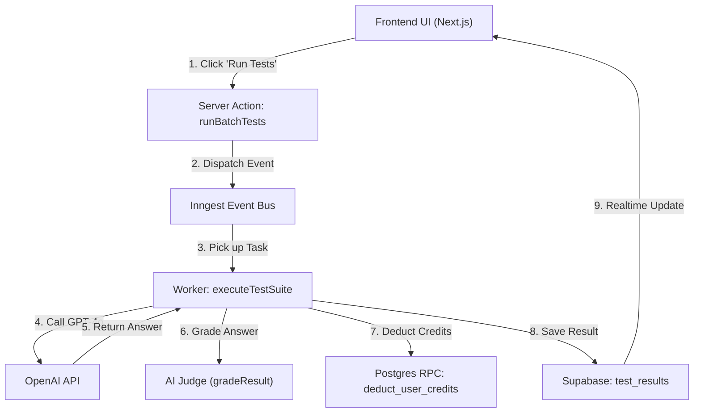
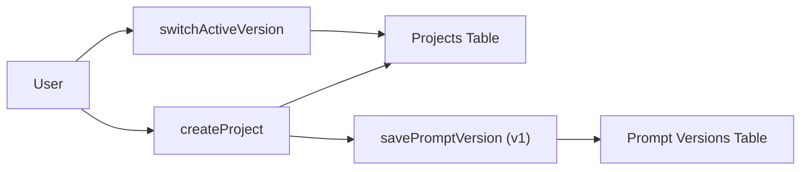

# 🗺️ Prompt Guard: Deep Logic Atlas

## 📊 1. System Mind Maps (Data Flows)

### 🔄 A. The Testing Lifecycle

### 📁 B. Project & Versioning Logic

---

## 📚 2. The Deep Atlas (Function-by-Function)

### 👨‍🏫 Core Concept: Simple Analogies
- **Supabase**: Aik bari "Almari" (Safe Storage) jahan sara data rakha jata hay.
- **Inngest**: Aik "Pehredaar" (Background Worker) jo mushkil kaam peeche beth kar karta hay.
- **OpenAI**: Aik "Aqalmand Ustad" (Teacher) jo hamaray sawalaat ke jawab deta hay.
- **Server Actions**: "Postman/Branch Manager" jo frontend aur backend ke darmiyan chittiyan (data) pohanchatay hain.

---

### 📁 `app/actions/ai-actions.ts` (AI Intelligence)

- **`gradeResult`**
  - **Asaan Roman Urdu**: Yeh function aik "Imtehaan Check karne wala Ustad" hay. Jab AI koi jawab deta hay, toh yeh function check karta hay ke woh jawab sahi hay ya nahi (Semantic Matching). Agar exact match na ho, toh yeh "Aqalmand AI" se poochta hay.
  - **Connections**: `OpenAI API`, `profiles` (Credits update), `test_projects` (Ownership check).
- **`simulateChat`**
  - **Asaan Roman Urdu**: Yeh "Practice Match" ki tarah hay. User apna prompt test kar sakta hay bina result save kiye.
  - **Connections**: `OpenAI API`.
- **`generateExpectedOutput`**
  - **Asaan Roman Urdu**: Yeh "Standard Answer Key" banata hay. Jab aap koi naya sawal daltay hain, yeh function AI se pooch kar aik ideal jawab set kar deta hay.
  - **Connections**: `OpenAI API`, `prompt_versions`, `profiles` (Cost deduction).

---

### 📁 `app/actions/test-runner-actions.ts` (The Orchestrator)

- **`createTestRun`**
  - **Asaan Roman Urdu**: Yeh function aik "Naya Register" khoobta hay. Testing shuru honay se pehle yeh batata hay ke kounsi prompt aur kounse version ka test ho raha hay.
  - **Connections**: `test_runs` table.
- **`runBatchTests`**
  - **Asaan Roman Urdu**: Yeh "Canteen Manager" hay. Yeh check karta hay ke user ke paas paise (credits) hain ya nahi, aur phir background worker (Inngest) ko signal deta hay ke kaam shuru karo.
  - **Connections**: `Inngest Event Bus`, `profiles`.
- **`getLatestTestRun`**
  - **Asaan Roman Urdu**: Yeh function "Purani Report" nikal kar lata hay takay user ko dashboard par purana result dikha sakay.
  - **Connections**: `test_runs`, `test_results`.

---

### 📁 `app/inngest/test-runner.ts` (The Engine)

- **`executeTestSuite`**
  - **Asaan Roman Urdu**: Yeh system ka "Asli Engine" hay. Yeh aik aik kar ke saaray sawalaat (test cases) uthata hay, AI se jawab mangwata hay, unko check karwata hay, aur database mein save karta hay. Iski khaas baat yeh hay ke agar network chala jaye toh yeh wahin se shuru karta hay jahan se ruka tha (Durable).
  - **Connections**: `OpenAI API`, `test_results`, `deduct_user_credits` RPC.

---

### 📁 `utils/model-pricing.ts` (The Accountant)

- **`calculateCost`**
  - **Asaan Roman Urdu**: Yeh system ka "Munshi" hay. Yeh calculation karta hay ke kounsa model use hua aur kitne words (tokens) kharch huye, phir batata hay ke user ke kitne points (credits) katne chahiye.
  - **Connections**: Credit System logic.

---

## 🛠 3. Tech Stack: Simple Breakdown

- **Next.js (The Shop Front)**: Yeh hamari "Dukan" ka front hay jahan user ko buttons aur widgets nazar aatay hain. Isay React based framework kehte hain jo fast loading mein madad deta hay.
- **Supabase (The Warehouse)**: Yeh hamara "Godown" hay jahan sara data (Projects, Users, Results) mahfooz rehta hay. Yeh real-time updates bhi deta hay (jaisay WhatsApp message foran aata hay).
- **Inngest (The Delivery Boy)**: Yeh background mein kaam karta hay. Jab heavy testing hoti hay toh yeh system ko hang nahi honay deta balkay peeche kaam karta rehta hay.
- **OpenAI (The Brain)**: Yeh wo "Dimagh" hay jo prompts ke jawab deta hay aur grades check karta hay.

---
**Summary**: Prompt Guard aik "AI Quality Control" system hay jo check karta hay ke computer sahi se jawab de raha hay ya nahi.
